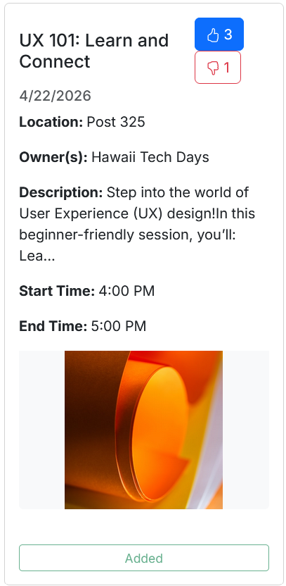

## Why even bother writing this?
This semester, I took a course on software engineering. One of the lessons the class attempted to impart was the importance of time estimates. Unfortunately, I believe that this lesson has somewhat backfired. I do want to note I understand that there is theoretical value in knowing how long it takes to do a task. After all, if you have no clue how long your team will take to develop your software, for example, how can you announce a release date to shoot for? However, if the plan was to convince me that this would help improve efficiency my professors have failed. 

## My Time Tracking Journey
The final project of my class was a group project, my group decided to create [a website to help the University of Hawaii community keep track of events](https://student-event-hub.vercel.app/). We were told to keep track of how long each individual task took us to complete as we were implementing them. Most of the individual steps were similar to previous homework assignments, and thus I thought the time it took to do the similar task after having done them before, usually twice, would be a good time estimate. I assumed that the time it took would be around how my second, more experienced run at similar tasks took. These second runs of homeworks were often well within the expected time provided on the homework assignments. So for the sake of science (and my grade), I set a stopwatch and timed my work. I will note that there were a few times I did forget to stop the stopwatch so some assignments were more accurately tracked than others, but when some of these tasks ended up taking multiple hours, I feel missing a few minutes was not that big of an issue. I also learned pretty far in I was supposed to track my thinking time, which I had not done at the start because I did not know it was needed, thus I had to estimate that. That said, there will be more on the thinking estimates later.

### Immediate Car Crash
Time estimates did not start off on a strong foot. Largely, this was due to the sheer amount of information on the assignment, which was poorly laid out, making keeping track of what was expected and when impossible. However I must admit a large portion of the immediate disaster of my own making. The first thing we were supposed to do was to create a starting database on Vercel. Unfortunately, I had other plans, and attempted to clean up the file managing our database environment, removing from the starter code we were working with tables that were integral to how the starter code ran. This did not end well. Vercel would not compile because of course it could not without being able to access the tables half the pages relied on. I tried to fix this by force and ended up wasting around seven hours. Admittedly, I had given myself two hours for the task, but this was well over my time limit. This struggle delayed my team's ability to do most other tasks to progress on the project. Admittedly, the disastrous effect was not from the estimate itself, but the estimate provided no added benefit to the process, and given that this was the sort of task a project only needs done once, long term benefits were minimal.

    
     A visual metaphor

### Static Shock
Another example of my estimates being atrocious was when I tried to get the cards that depicted the events the website tracked to include like and dislike buttons that users could click to express their opinions. I realized that the after having spent less than a week working on react, which had been over a month ago, I had overestimated my ability to use create function on click events. Though I will note that in my defense, none of the react tutorials and exercises we had been given actually called on combining those skills with other tools such as Bootstrap, which we used to style the website, or more importantly Prisma, which we used to manage our databases. The latter turned out to be a big deal, as after taking over two and a half hours on what I thought was going to be a fifteen minute task, I then took up the next task of getting these cards to use data from the database. To be fair, if the like and dislike buttons had not been there, this would have taken around the amount of time I anticipated. On the one hand, this left me with the misfortune of discovering the limits of the tools we were given, but on the other this was a lesson my group was going to learn at some point anyway. As we soon discovered, React's synchronous events system conflicted with Prisma's asynchronous data calling. We were hit with a Catch 22: to have the like and dislike buttons update in real time, we needed the code to use the local client, but to retrieve the data needed to display the event cards those buttons were on, we needed our function to have the keyword async. Getting a workable solution to this puzzle I had not anticipated took me well outside the time I had allotted myself for the task. The issue I expected to take half an hour again ended up taking more like seven, and that is discounting time spent thinking about it while I went about my day.

    
     An example of the event cards

### The Closest Tracking Got to Being Useful
There were a few tasks where tracking nearly was useful. These tasks were usually ones where I had already done a similar task just recently, and either knew in advance what I needed to get the code to work, or knew where to look for a solution to my problems. For example, after figuring out how to get Prisma to query the database on the condition that the user had added the event to their list of saved events so that the "Your Events" page would display the events they already planned on attending, I was confident I knew where to look to figure out filtering those events on the condition that the time the event ended had not already passed so that the list of upcoming events would only consist of events there were actually upcoming. So I set an estimate, started my timer, and got rather close to my estimated time of completion. I still wouldn't exactly call this helpful, as taking the time in the workplace to measure out tasks that small would end up consuming more time in managing timers than it would save, but at least here the time tracking was merely an annoyance instead of a stressor.

## What I would change
While I am obligated for a grade to say what I would change for my own time tracking (which presumes I would ever willing do it again) I would also like to give a note on what I would change about the assignment if I were the one teaching the course that made me partake this journey. If I were forced to do something like this, I would if possible suggest putting not one estimate, but at least two. The first would be what I would expect the task to take if the task were to go smoothly without any large, unexpected errors. The second would be a time estimate if I ended upon a crash inducing error with no foreseen solution. This may sound extreme, but I cannot stress enough that the majority of my time working on the Student Event Hub page was spent fixing bugs I had not anticipated that were crucial to fix to get the site working as intended. Save that, I would only use effort estimates on topics with which I already had more confidence. Unsurprisingly, having only taken a shallow toe step into the waters of software engineering, I was not experienced enough to know what I did not know, and thus any expectation that I would know how to fix these issues in a timely manner would be entirely unfounded in reason.

### What Does Non-Coding Effort Mean?
To repeat the title of the section, I ask: what does non-coding effort mean? Seriously. I still don't know. None of my class's assignments prior to the final project mentioned non-coding effort, and the final project's requirements were so vastly arrayed over a half dozen modules that I failed to notice until nearly the end of the project that this was something I was supposed to be tracking. Yes, I have some idea what was wanted of me, after all I know what it means to think about a problem. However I find it an unreasonable task to expect me to track the time I spent thinking. Certainly you *could* track the time difference between the start of a task and its final commit. However this doesn't make much sense when, as previously mentioned, some of the tasks took me days of work to complete. (As a quick aside, I want to preempt the counter-argument that this meant tasks were to big by pointing out that some of these, like getting the database set up on Vercel could not reasonably be broken into smaller chunks, while others, like solving the event card paradox seemed like they were reasonably sized before hitting a wall of errors.) Obviously I did not spend all my waking hours over a few days thinking of solutions to bug fixes, but it would also be wrong to attribute none of the time to it. Furthermore, while some of the time spent thinking of solutions was an active exercise in figuring out what needed doing, I find that often the best solutions are found not in actively thinking of a solution, but letting it rest on the metaphorical back burners of one's mind while going about other tasks. This inactive thinking is nigh impossible to actually track. Thus if I were to, for some reason, for time tracking on some poor hapless sap, I certainly would not even consider asking them to figure out how much of their time they spent thinking of the tasks.