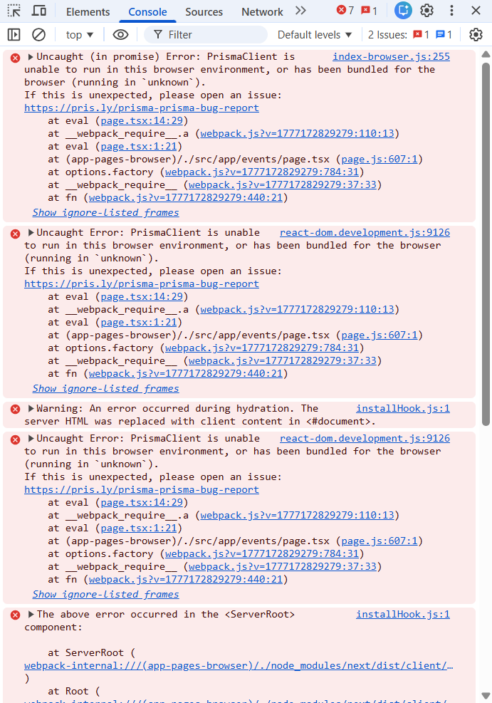

## Computer Scientists reinvented the wheel again
If you've paid attention to the tech industry for long enough, you've probably seen Silicon Valley proclaim the genious of this brand new idea they've just came up with, only for others to point out that they've recreated something that already exists. For example, in a previous essay I cited the concept of [Roko's Basilisk](https://en.wikipedia.org/wiki/Roko%27s_basilisk) and called it a dumber version of [Pascal's Wager](https://en.wikipedia.org/wiki/Pascal%27s_wager), a connection [multiple](https://journal.equinoxpub.com/IR/article/view/3226) [others](https://www.bbc.com/future/article/20190801-tomorrows-gods-what-is-the-future-of-religion) have also made. Other examples include [reinventing vending machines](https://www.vanityfair.com/news/2017/09/bodega-vending-machine-startup-backlash) and [reinventing student loans](https://www.theguardian.com/commentisfree/2019/jan/14/silicon-valley-marketing-student-loan). This essay intends to discuss another concept computer scientists borrowed is the concept of design patterns — though according to [Dr. Philip Johnson's lecture on the topic](https://www.youtube.com/watch?v=Z2yjimK_MJU) this time it was done with intent and recognition.

The concept of design patterns, originally from the field of architecture (as in physical architecture, not software architecture) is an explanation of an approach to a problem (for example: how to design a roof), the purpose of the design, the advantages it has and its disadvantages. If it helps, one can think of them as like algorithms, but for higher concepts instead of giving the user the step by step details of how to achieve a goal. If you want a more in depth explanation of what a design pattern is, watch Dr. Johnson's lecture.

## We accidentally did that on purpose
Early this month (for posterity that would be April 2026) or late last month, I started working with three of my classmates ([Jayden Cruz](https://jaydenpc.github.io/), [Ahron Natividad](https://ahron4.github.io/), and [Kadon Nakano](https://kadonnakano.github.io/)) in my software engineering class on our final project for the class. Namely our project is the [Student Event Hub](https://student-event-hub.vercel.app/) (the github of this can be found [here](https://student-event-hub.github.io/)). For more details see the github, but the basic idea is for the project to be a way for students of the University of Hawaiʻi at Mānoa to keep track of events they are interested in, as well as another way for students to spread the word of events they are hosting or are interested in to others.

For this project we used the existing [Bowfolios](https://bowfolios.github.io/) project designed and maintained by UHM Information & Computer Science professors as our starter code. We also essetially used the design pattern of the Bowfolios project for our own project, however I would not describe this as a fully intentional decision. Certainly some of the decision to design our code after the Bowfolios project for the same reason we used it as starter code: the project includes infrastructure similar to how we imagined our project looking and behaving. One way we intended on using the design pattern of Bowfolios intentionally in that we intended to have our events be filterable using the same user prompting methodology the Bowfolios project uses on its filter page.

### Uh-oh, buggy!
Unfortunately, like all plans, our project plans did not survive first contact with deployment. There were a number of bugs irrelevant to the concept of design plans, such as the Bowfolios dependencies for authorization being too far out date to deploy to vercel, forcing us to rework the authorization systems which we did not have a sufficient grasp of, leading to many bugs surrounding the log in feature of the site.

More relevant here, however, was that there was one feature (or rather lake there of) in Bowfolios that very much conflicted with our plans. We wanted to implement interactive buttons on the all events pages that modify the data displayed and the data in the database. For example, we wanted to let users like and dislike events, and to have those buttons update the likes and dislikes in the database in real time. We also wanted to let users filter what events show up on the all events page, to find events of their interests. However, the issue we faced is that the design patterns of Bowfolios only covered static, asynchronous data loading, with all client side pages dedicated to adding or modifying database objects. This meant when we first tried to implement our events page loading data from the database the results were... not ideal. It took a while to search to find a design pattern that would actually work which at time of writing still hasn't been fully implemented.

