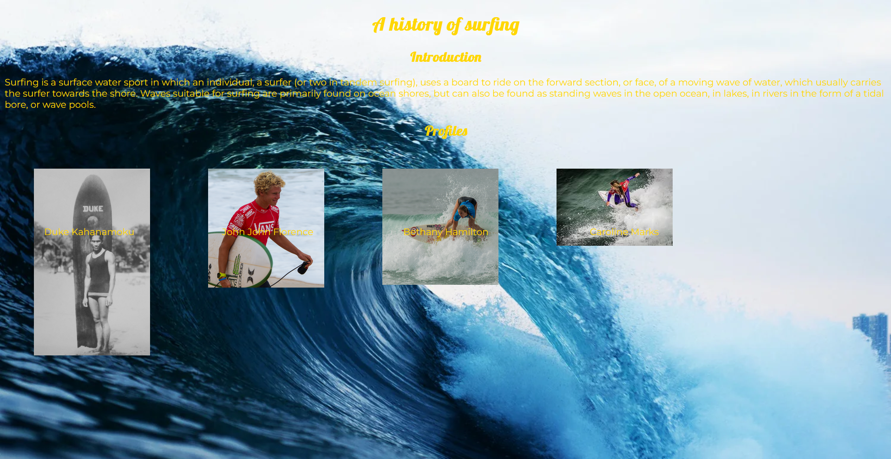

## Mobile websites used to suck

Do you remember what websites looked like on early smartphones? Heck, do you remember what most websites looked like on smartphones before Covid 19? If you don’t, aside from the implications that has on my (and likely most readers’) age, I’ll tell you: websites that actually looked good on a cell phone used to be few and far between.

### All websites used to suck

Originally I was going to spend a paragraph of this essay inviting you to look at the websites for some local restaurants on your phone. They used to be consistently awful, designed only for PC/laptop usage. However I am glad I decided to try this out for myself before finishing this essay, because now it would appear websites poorly optimized for cell phones are the exception, not the rule. I wanted to make a point about the importance of good ui design by showing bad ui design with it because I know that those of us that remember the so-called “web 1.0” are now an ever decreasing subset of the population.

### I feel old now

That most college students these days don’t remember web 1.0 was only brought to my attention by a professor commenting on a warm-up assignment (the goal was to make a web 1.0 style ugly website). Below is the website in question. If you’re not old enough to remember, yes, old school websites really would often have a bunch of shady download links like this, with only a little more effort made to hide their nature as a virus.

Tangent aside, the purpose of showing this website is to show why ui frameworks are so important. Yes the colors clashing awfully is an intentional choice, so decently large aesthetic improvements could be made easily, but getting a truly good looking website without a ui framework is still genuinely difficult. Below is another example from an assignment. The sources of the images I don’t recall, mostly wikipedia I believe, and the text also comes from wikipedia. This represents my genuine best effort with thirty minutes of time to make a website where text is overlaid on images without using a ui framework. Admittedly there are some tricks that I would have applied if I weren’t in a panic, such as using percentile placements for both the images and the text, so I wouldn’t need to guess where the center of each is. However there is a much easier way to do something like this than to code everything in CSS from scratch: using a ui framework.

## ui Frameworks 

For those not in the web design or software engineering spaces, it is probably sufficient to use tools like [Squarespace](https://www.squarespace.com/), [WordPress](https://wordpress.com/) or other similar tools. They offer services that let you customize your website plenty well, and even offer services like hosting servers. However if you want to get into the nitty gritty of it, you really should try to use HTML and CSS libraries directly, such as [Bootstrap 5](https://getbootstrap.com/). There are a slew of other libraries, as I understand them, most of them work rather similarly, and most will get the job done. These tools are an absolute life saver.

# So powerful it's (almost) foolproof

Below is a mock up I made with Bootstrap 5 of a website (presumably an older design of their website) for [the Maui Brewing Company](https://mauibrewingco.com/) for an assignment earlier today. While the page isn't perfect, consider that this took under an hour to make. It also was made by me, and to be honest, I’m actually not (yet) all that good with actually using Bootstrap 5.

