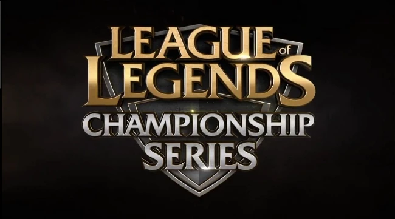

One fact about me that is probably obvious to anyone who has met me is that I am something of a nerd. I am unapologetic about enjoying video games, and only a little apologetic about enjoying watching professional video game tournaments aka esports. Some people are LA Dodgers fans, some people are New England Patriots fans, some people are Chicago Bulls fans, I am a Cloud9 fan. (Note that the omission of a space there is intentional, as the team’s name is one word.) I first watched Cloud9 play in the League of Legends Championship Series (LCS for short) Season 3 Summer Promotion tournament in May of 2014. (Actually the team was named Team Quantic at the time, but they re-renamed themselves back to Cloud9 after qualifying.) I have been following the professional League of Legends circuit ever since (even as I now no longer actually play the game myself).

How the idea came to me is lost to time, but at the end of 2018 I had the idea of finding a way to numerically rate teams. I knew such rating systems existed in things like professional chess, and I knew that League of Legends itself had a “match making rating” using a similar method. So I did what I often do when I want to learn something new: I spent a few hours googling and reading wikipedia about the [elo rating system](https://en.wikipedia.org/wiki/Elo_rating_system) so I could rate my favorite teams. Unfortunately while I did succeed, I didn’t know how to program at the time, so instead I automated the functions required in a Google Sheets spreadsheet, and input the individual teams and their previous scores into each row of my spreadsheet. This was too menial a task even for my bored self after about 500 games. This left me with over 17,000 matches left if I wanted to cover all prior international tournaments and the top level leagues that qualified for them.

Fast forward a few years to 2022, and having learned Python, I decided to try again. This time I copied down match history data from what I consider to be the best database for professional League of Legends, [Leaguepedia](https://lol.fandom.com/wiki/League_of_Legends_Esports_Wiki) and compiled over 22,000 matches into a spreadsheet, which I then downloaded as a csv file. I then learned how to read this file in Python, and implemented my elo system that way. Admittedly, if I had kept up with the project there are a number of changes that likely would have been needed, for example the program only checked for team names, which didn’t work very well in a competitive scene that early on was full of teams that renamed themselves for sponsorships or company owned teams dropping entire rosters to bring in a full squad of new players right after; a new squad that often all previously played together under a different team name. However my break from school came to an end and with the new semester I dropped the project.

Currently I cannot provide the source code for the project because the computer I created it on broke, and my relationship with cloud storage is antagonistic. If I can track down this code I will create a github project for it and link to it. However, a few year or two later Amazon, for some reason, decided to sponsor the creation of [their own Elo tracker for professional League of Legends](https://lolesports.com/en-US/gpr). That said, I don’t believe theirs is open source.
