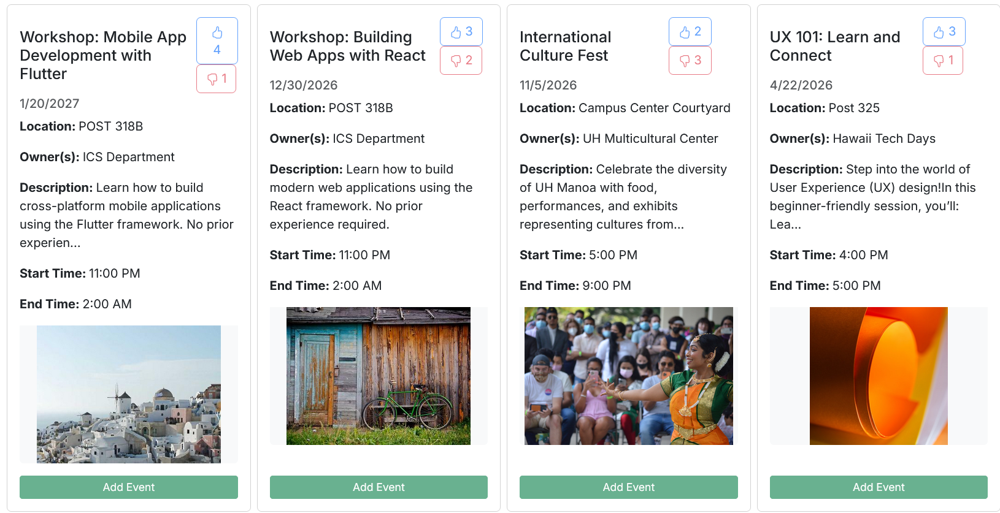

One thing I found difficult when I transferred to UH Manoa was that there was far less orientation information given to me than what I would receive as a starting freshman, especially since I was not living on campus. I felt locked out of the loop of what events were going on when and where. In the time since I have noticed that postings for events at UH are very eclectic and often poorly updated. Thus when my software engineer course's final project was to create a webpage that would be useful to the UH community, I suggested to my group partners the idea of a website for the sake of posting and tracking events. Thus Student Event Hub was born. Student Event Hub allows users to post events they want to spread the word about to the website, save events to their own personal calendar, and rate events. 

    
     Above are examples of howe events are displayed on the website.

Tasks on the project were relatively evenly split. Some of my larger contributions were right at the beginning. I was the one to set up deploying the webserver and database on Vercel. I also did the database set up and a lot of the database management, like adding the table for the events as well as necessary cross-referent tables for the events. I designed the like and dislike buttons (but not the counters beside them that track how many likes and dislikes events have). I was the one to get the cards the events are displayed on hooked up to data from the database, and did the initial implementation of getting those cards to display on the "All Events" page. This turned out to be a lot harder than expected as the like and dislike buttons needed to be client side but pulling the data from the servers needed to be asynchronous. I also did most of the implementation for the "Your Events" page, that tracks what upcoming saved events the user has, as well as saved events that have passed.

The project served as a good practical lesson on the difficulties of software engineering, web development, and coding in a group environment. There are a lot of small practical things we learned, like how to break down bigger problems into smaller steps, how to describe those steps so colleges what is expected of them, and how to handle merge conflicts in practice. If you want to visit our website, [click here](https://student-event-hub.vercel.app/). If you want to see the GitHub Pages site we made for the project, [click here](https://student-event-hub.github.io/). Finally if you want to see the repository for our project, [click here](https://github.com/student-event-hub/student-event-hub.github.io).
